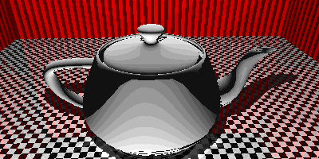

# raygo

raygo is a CPU implemented raytracer with a YAML description interface. The algorithms are based on the book
by Jamis Buck [The Ray Tracer Challenge](http://raytracerchallenge.com/).

Images can be rendered as still images (PPM (default) and PNG) or as GIFs. For GIF rendering you need to
describe an animation in your description.

Below a table of available commands and one example with corresponding YAML description. The rest of this
documentation will be about the elements that you can use in your YAML descriptions.

| Command |  Description  | Example | Mandatory? |
|:-----|:--------|:--------|:--------|
| -f <path>   | Input file | `./raygo -f teapot-scene.yaml` | ✔️ |
| -o <name>   |  Output file name  | `./raygo -f teapot-scene.yaml -o teapot` | ✖️ (default: 'default') |
| --png   |  Flag for PNG format  | `./raygo -f teapot-scene.yaml -o teapot --png` | ✖️ (default: ppm) |

Example:



<details>

<summary>YAML to generate this GIF</summary>

```yaml
width: 400
height: 200

colors:
  - name: light_gray
    r: 229
    g: 229
    b: 229
  - name: black
    r: 0
    g: 0
    b: 0
  - name: red
    r: 229
    g: 25
    b: 25
  - name: burnt_umber
    r: 110
    g: 38
    b: 14

patterns:
  checker:
    - name: gray_black_pattern
      colorA: light_gray
      colorB: black
      transforms:
        - type: scaling
          x: 0.33
          y: 0.33
          z: 0.33
  stripe:
    - name: umber_red_stripe
      colorA: burnt_umber
      colorB: red

materials:
  - name: ceiling_mat
    pattern: gray_black_pattern
  - name: floor_mat
    pattern: gray_black_pattern
    reflective: 0.3
  - name: wall_mat
    pattern: umber_red_stripe
  - name: teapot_mat
    reflective: 0.0

scene:
  planes:
    - name: floor
      material: floor_mat
    - name: ceiling
      material: ceiling_mat
      transforms:
        - type: translation
          x: 0
          y: 40
          z: 0
    - name: back_wall
      material: wall_mat
      transforms:
        - type: translation
          x: 0
          y: 0
          z: -40
        - type: rotation
          x: 1.570796 # pi / 2
    - name: left_wall
      material: wall_mat
      transforms:
        - type: translation
          x: -40
          y: 0
          z: 0
        - type: rotation
          y: 1.570796
        - type: rotation
          x: 1.570796
    - name: right_wall
      material: wall_mat
      transforms:
        - type: translation
          x: 40
          y: 0
          z: 0
        - type: rotation
          y: 1.570796
        - type: rotation
          x: 1.570796
    - name: front_wall
      material: wall_mat
      transforms:
        - type: translation
          x: 0
          y: 0
          z: 40
        - type: rotation
          x: 1.570796
  objects:
    - name: teapot
      file: resources/teapot_high.obj
      material: teapot_mat
      transforms:
        - type: rotation
          x: -1.570796

light:
  p:
    x: -3
    y: 30
    z: -20
  intensity:
    r: 255
    g: 255
    b: 255

camera:
  from:
    x: 0
    y: 25
    z: -30
  lookAt: teapot
  up:
    x: 0
    y: 1
    z: 0
  animation:
    degrees: 360
    timeSec: 5
    fps: 24
```
</details>

## General information

There are some entities that can either be used directly (as in: define them where they are needed) or via
a named version of that entity. The named version has the advantage of being reusable and being given a
hopefully descriptive name.

Those entities are:
* Colors
* Transforms

It is syntactically not forbidden to define both in a containing entity. Consider for example following yaml:
```yaml
width: 400
height: 200

colors:
  - name: light_gray
    r: 229
    g: 229
    b: 229

materials:
  - name: example_mat
    color: light_gray
    rawColor:
      r: 0
      g: 0
      b: 0
```

That is a valid material. The **named version always takes precedence** over non-named versions.
This also holds true for transformations.

## Printing OBJ information

To get information about the contents of an obj file you can call raygo with an obj file as input.

```
./raygo -f resources/teapot_high.obj
```

This gives following information:

```
Vertices: 3241
Faces(root): 0
Normals: 3242
Groups: 1
Bounds:
        Min: (-15, -10, 0)
        Max: (17.17, 10, 15.75)
```
