## raygo

Go lang implementation of [The Ray Tracer Challenge](http://raytracerchallenge.com/)

## Implementation progress

1. Tuples, Points and Vectors ✔
2. Drawing on a Canvas ✔
3. Matrices ✔
4. Matrix Transformations ✔
5. Ray-Sphere Intersections ✔
6. Light and Shading ✔
7. Making a Scene ✔
8. Shadows ✔
9. Planes ✔
10. Patterns ✔
11. Reflection and Refraction ✔
12. Cubes ✔
13. Cylinders
14. Groups
15. Triangles
16. Constructive Solid Geometry (CSG)
17. Next Steps

## Examples

### Chapter 5
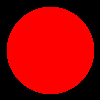

Drawing of a sphere via ray-sphere intersections.

### Chapter 6
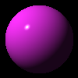

Drawing of a sphere with lightning via phong shader.

### Chapter 7
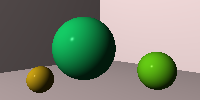

Scene drawn from the viewpoint of a camera

### Chapter 8
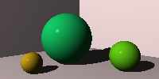

Shapes now cast shadows

### Chapter 9
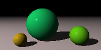

Plane got added as additional shape

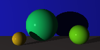

An additional plane got added as backdrop.

I think the reason why the ground looks so much darker is because I lowered the light. The flat reflection angle is probably why
the floor looks so dark compared with the other image.

The following image is fundamentally the same besides the light being higher.

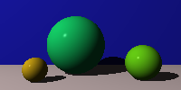

### Chapter 10
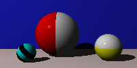

Spheres with attached stripe patterns

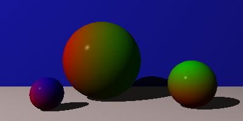

Spheres with attached gradient patterns

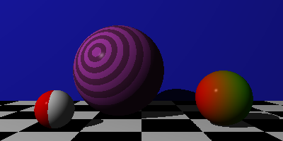

Multiple patterns at once

### Chapter 11
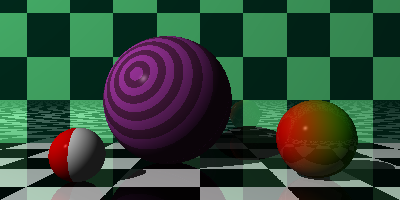

Material can now be reflective

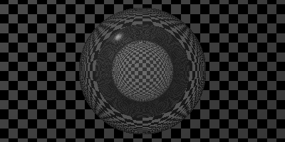

A glass sphere on the outside that contains a sphere of air in the inside

### Chapter 12

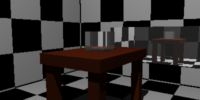

Cubes got added as shapes