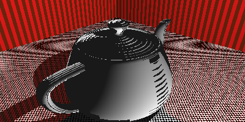

## raygo

Go lang implementation of [The Ray Tracer Challenge](http://raytracerchallenge.com/)

## Implementation progress

1. Tuples, Points and Vectors ✔
2. Drawing on a Canvas ✔
3. Matrices ✔
4. Matrix Transformations ✔
5. Ray-Sphere Intersections ✔
6. Light and Shading ✔
7. Making a Scene ✔
8. Shadows ✔
9. Planes ✔
10. Patterns ✔
11. Reflection and Refraction ✔
12. Cubes ✔
13. Cylinders ✔
14. Groups ✔
15. Triangles ✔
16. Constructive Solid Geometry (CSG)
17. Next Steps

I don't think that I'll implement CSG, because I don't see the use case for myself at this point.
Feel free to submit a PR though.

## Custom improvements

1. Performance optimisations (multithreaded rendering + caching)
2. Camera movement & multi frame rendering

## Examples

### Chapter 5


Drawing of a sphere via ray-sphere intersections.

### Chapter 6


Drawing of a sphere with lightning via phong shader.

### Chapter 7


Scene drawn from the viewpoint of a camera

### Chapter 8


Shapes now cast shadows

### Chapter 9


Plane got added as additional shape


An additional plane got added as backdrop.

I think the reason why the ground looks so much darker is because I lowered the light. The flat reflection angle is probably why
the floor looks so dark compared with the other image.

The following image is fundamentally the same besides the light being higher.


### Chapter 10


Spheres with attached stripe patterns


Spheres with attached gradient patterns


Multiple patterns at once

### Chapter 11


Material can now be reflective


A glass sphere on the outside that contains a sphere of air in the inside

### Chapter 12


Cubes got added as shapes

### Chapter 13


Cylinders and cones got added

### Chapter 14


Groups are now added, allowing for creating reusable complex shapes and performance improvements.

The implementation differs slightly from the book. The implementation of the bounding box intersection is
according to [this blog article](https://tavianator.com/2011/ray_box.html)

### Chapter 15


### Multi frame rendering & camera movement

It is now possible to define a simple, circular camera movement around a given point. Following parameters are
configurable:
* Camera rotation in Radians
* Duration of the movement in seconds
* How many frames per second are to be rendered
For still images it is easiest to set the duration to 1 and define via FPS parameter how many images you want
to be rendered.

Here is an example with the following parameters:
```golang
animation := scene.CreateCameraAnimation(math.Radians(90), 1, 3)
cam.Animation = animation
```

Image #1

Image #2

Image #3


## Outlook

These are the next steps for me:

* Scene descriptions in YAML format
* Camera smoothing for stop & start of movement
* More sophisticated camera movement options (define anchor points and have the camera move to them in order)